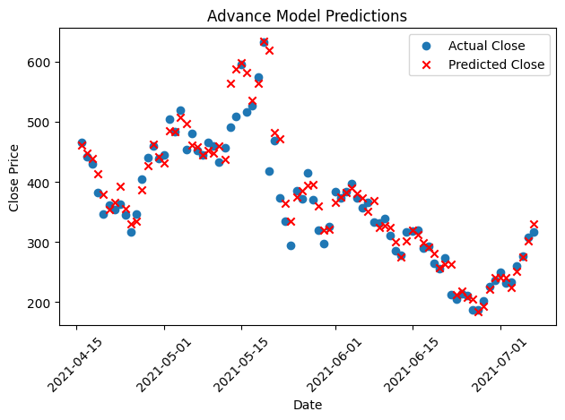

# Sri Supratik Talari – AI/ML Challenge

Welcome to my **AI/ML Challenge Project**!

My name is Sri Supratik Talari I am a Data Science Major At University of California San Diego.

## Introduction

For this challenge, I decided to pursue the AI/ML challenge, which asked me to create a predictive model for stock prices.
The dataset that I am using has information on the Aave stock from 2020-10-05 to 2021-07-06, which can be found on Kaggle.
The dataset has several features that provide information on the Aave stock. For our purposes, we will only be using
a selected set of all the available features.

1. Date
   - The date the infromation was recorded
   
2. Open
   - The opening price of the stock on the recorded day

3. High
   - The highest price the stock reached on the recorded day

4. Close
   - The closing price the stock reached on the recorded day

## Models

### Linear regression

The first model that I have decided to create is a base model for linear regression using one feature.
My feature of choice was the low price because, from my exploratory data analysis, I found that the low price
has a strong positive linear relation with the closing price. First, I had to split the data up into training
and testing data using a 70/30 split method. Afterwards, I fitted my data on the training data and made predictions
using the test data.

- Base Model Predictions

Looking at the graph above, we can see that the model does well, but to interpret it using
numerical terms, we will calculate the RMSE.

RMSE: 41.265456837173986.

### Multi-Linear Regression Model

After creating a base model, I decided to take it a step further by creating a multi-linear regression
model. This model uses two different features to make its predictions: Open and High. I fitted this new
model on the same training data, as well as made predictions with it using the same test data.

- Multi-Linear Regression Model

RMSE: 32.49124588052414

### ARIMA Model

Linear regression models are quite basic but effective models to use for this data.
To take it a step further, I decided to create a Time Series model because there is a time
element to this dataset. First, I conducted an ADF test to see if a Time Series model would be
a good choice for this dataset.

ADF Result: Non-Stationary

Because the test returned a non-stationary value, time series would not be a great fit for this dataset.
However, I decided to continue to make a model so that we can compare how well each model performed on this
dataset. The first model that I decided to make was an ARIMA model, which is a Time Series model that makes
predictions without accounting for the seasonality of the dataset. This model requires certain parameters (p, d, q) to make
accurate predictions. To find those parameters, we first need to find the range of values to choose from. We can accomplish this
by plotting the ACF and PACF plots.

- ACF

Looking at the plot above we can see that the range of values for our q parmater 
is between 1 and 24.

- PACF

Looking at the plot above we can see that the range of values for our p parmater 
is between 1 and 35.

Now that we now the ranges we can conduct hyper parameter tuning to find the best combination of 
of these parameters so that our ARIMA model can make accurate predictions.

Best combination of (p,d,q): (35,2,1)

Now we can fit out ARIMA model and make predictions 

- ARIMA Model Predicitons

RMSE: 215.42741596338172

### SARIMA Model

The final model that I will be making is SARIMA model. Which is much like ARIMA with one key
distinction when making predictions it accounts for the seasonality of the dataset. 

- SARIMA Model Predictions

RMSE: 1630.0533164598974

Looking back at the previous models it is clear that the Multi-Linear Regression model was the best because
it has the lowest RMSE out of all the models. Meaning it is the most accurate at predicting the Aave stock price.

### Technologies Used
A small portion of the project was coded by ChatGPT mainly for the purpose of helping with erros and for the creation of some plots.

## Things That I Would Have Done Differently

Due to other commitments, I was not able to give this challenge my full attention. If I were given the opportunity to redo this project,
I would like to make several improvements. The first would be the overall documentation of my code. My current documentation of the code is quite basic;
I feel like there is much more that I could do — perhaps explain the steps I have taken and the techniques that I have used in more detail. I would also like to
research and apply more predictive models to this dataset, specifically other Time Series Models. The final improvement that I would like to make on the coding section
is more advanced visualizations, as I have only used the most basic for this project. On the front-end side of things, I would have also liked to create a website that people
can access so that they can read up on my findings. This website would also have interactive elements to the visualizations that I would add to it.
